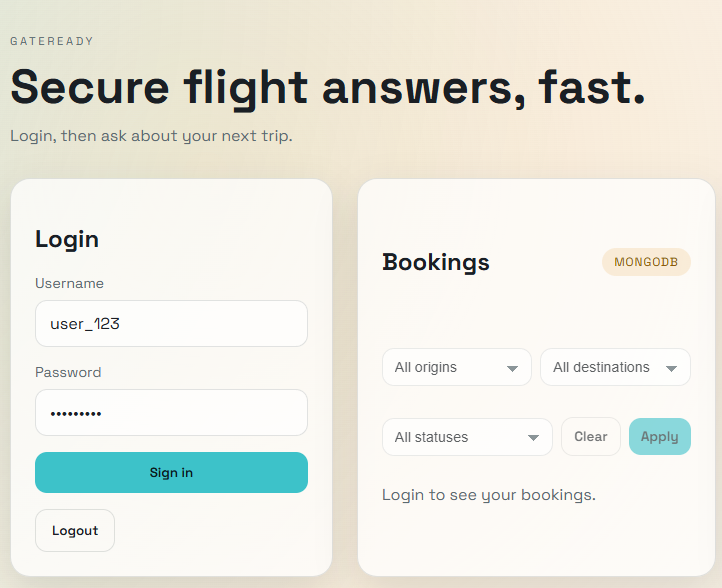
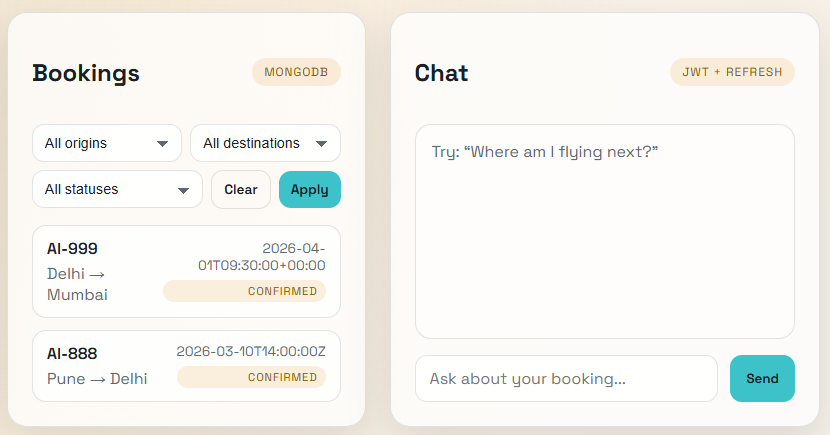
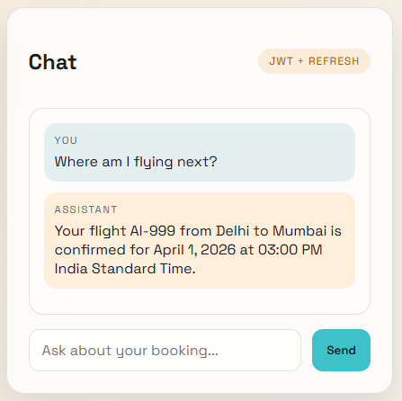
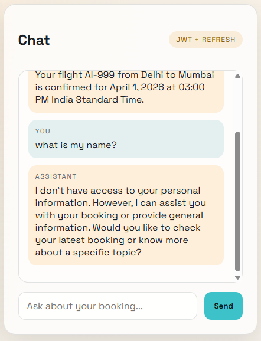
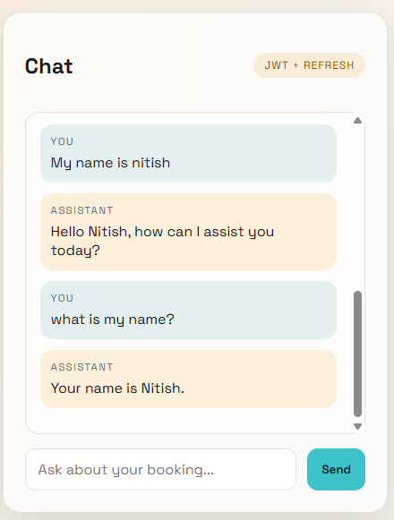
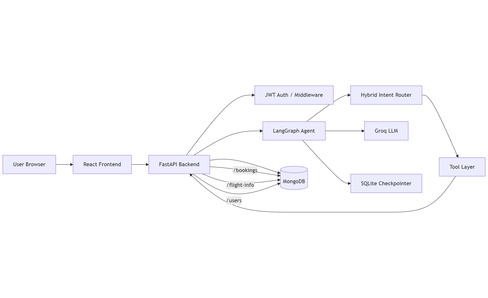
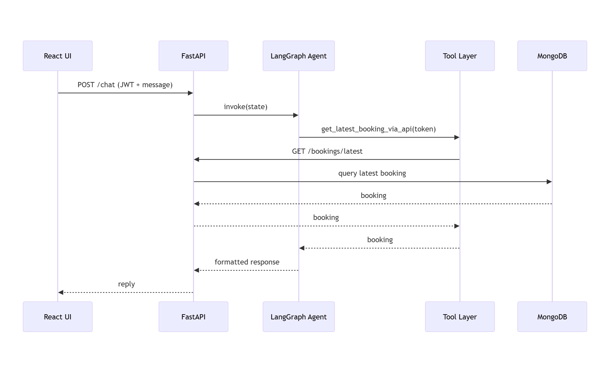
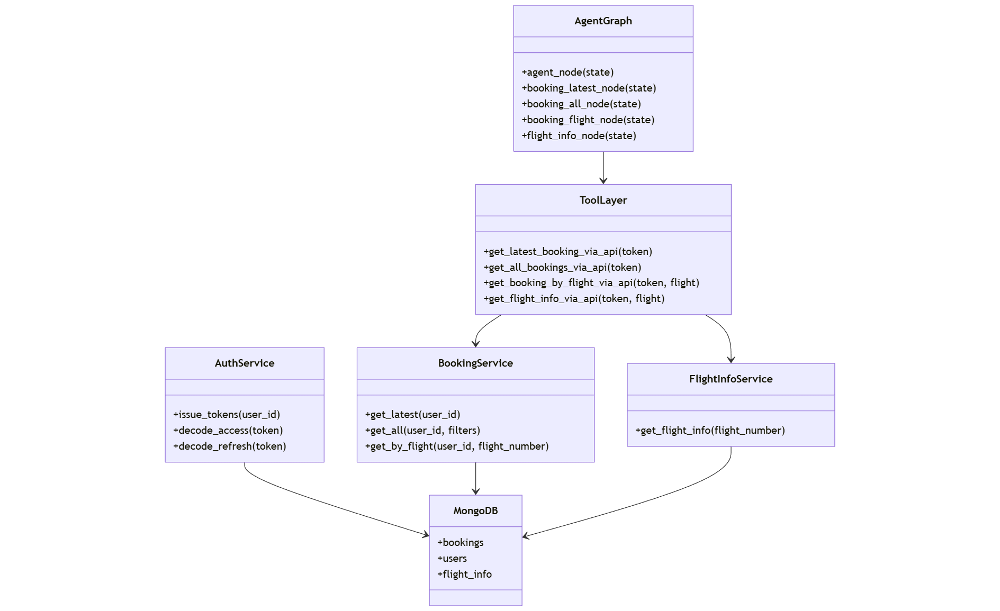

# GateReady (SDE Portfolio)

Secure, stateful AI booking assistant with authenticated tool use, LangGraph routing, and MongoDB-backed data.

## Highlights

- JWT auth + refresh + logout
- LangGraph state machine with checkpointed memory
- Hybrid intent routing (rules first, LLM fallback)
- Booking tools (latest, all, flight-specific)
- Flight details via RAG-style text retrieval
- React frontend (login + chat + bookings + filters)

## Screenshots

**Login screen**  


**Bookings list + chat view**  


**Chat: latest booking response**  


**Chat: identity unknown before user shares name**  


**Chat: remembers name within session**  


## Architecture (High Level)

```text
React UI
  │
  ├─ Login / Chat / Bookings
  ▼
FastAPI API
  ├─ Auth (JWT + refresh + logout)
  ├─ Agent /chat (LangGraph)
  │    ├─ Intent routing (rules → LLM fallback)
  │    ├─ Tool calls (API-first)
  │    └─ Checkpointed memory (SQLite)
  ├─ /bookings (MongoDB)
  └─ /flight-info (MongoDB, text docs)
```

## Diagrams

**High Level Design (HLD)**  


**LLD — Sequence Diagram**  


**LLD — Class Diagram**  


## Backend

Create a virtual environment, then install deps:

```powershell
python -m venv .venv
.\.venv\Scripts\Activate.ps1
pip install -r backend\requirements.txt
```

Run the API:

```powershell
uvicorn app.main:app --reload --app-dir backend
```

Create a `.env` file in `backend/` with:

```
MONGODB_URI=mongodb+srv://<user>:<password>@cluster0.gku8jay.mongodb.net/
MONGODB_DB_NAME=booking_assistant
MONGODB_BOOKINGS_COLLECTION=bookings
MONGODB_USERS_COLLECTION=users
MONGODB_FLIGHT_INFO_COLLECTION=flight_info
API_BASE_URL=http://127.0.0.1:8000
GROQ_API_KEY=your_key_here
GROQ_MODEL=llama-3.1-8b-instant
JWT_SECRET=dev-secret
JWT_REFRESH_SECRET=dev-refresh-secret
ACCESS_TOKEN_TTL_MINUTES=15
REFRESH_TOKEN_TTL_DAYS=7
CHECKPOINT_DB=backend/checkpoints.sqlite
```

Notes:
- The agent tool calls `GET /bookings/latest` via HTTP (API-first), so `API_BASE_URL` must point to this FastAPI server.
- If your LangGraph version supports `SqliteSaver`, checkpoints are stored in the SQLite file pointed to by `CHECKPOINT_DB`. Otherwise it falls back to in-memory checkpoints.
- Flight info for RAG-like answers is stored in the `flight_info` collection and accessible via `/flight-info/{flight_number}`.

Seed demo data:

```powershell
Invoke-RestMethod http://127.0.0.1:8000/seed -Method Post
```

## Frontend

```powershell
cd frontend
npm install
npm run dev
```

Optional `.env` for frontend:

```
VITE_API_BASE=http://127.0.0.1:8000
```

## Core Endpoints

- `POST /login` → access + refresh token
- `POST /refresh` → refresh access token
- `POST /logout` → revoke refresh + clear memory
- `POST /chat` → chat with the agent
- `GET /bookings` → list bookings (filters: origin, destination, status)
- `GET /bookings/latest` → latest booking
- `GET /bookings/flight/{flight_number}` → booking by flight
- `GET /flight-info/{flight_number}` → flight info text
